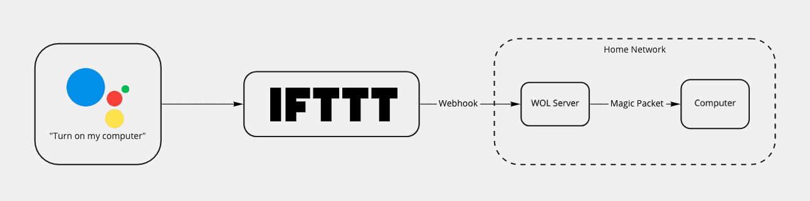
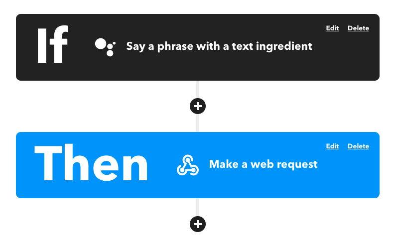
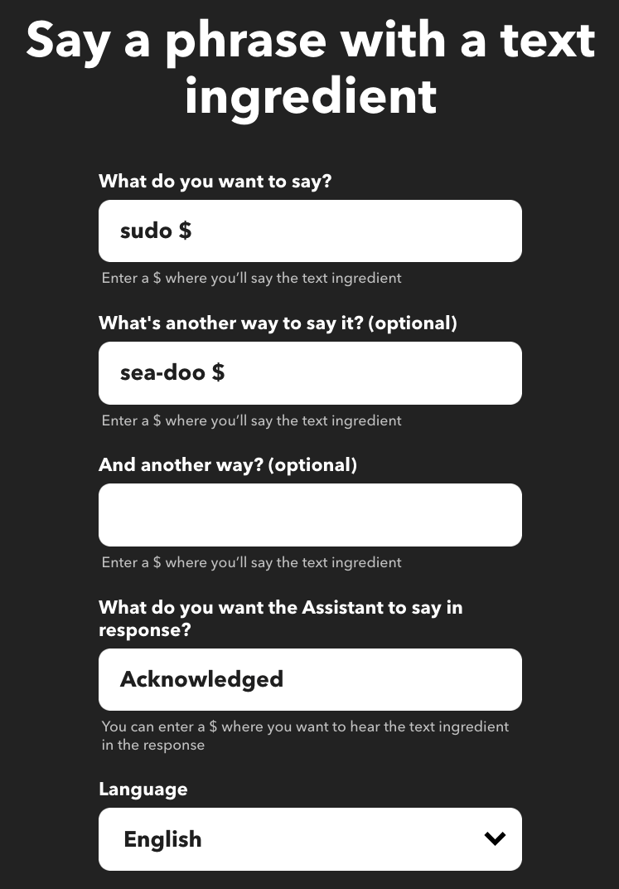
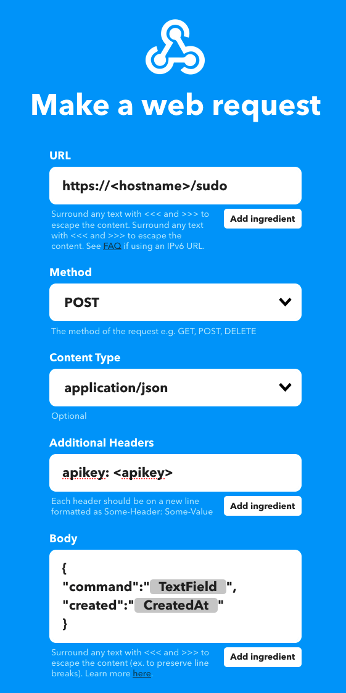

# Sudo Home Automation Webhook Server

The goal of this project is to have a running locally on a server in your home network that is exposed to the outside world. You can then use a webhook from a service like IFTTT or something similar to set up a voice command from a home automation assistant.

Currently I only have a Wake-On-Lan handler - Credit to https://github.com/sabhiram/go-wol for the magic packet code!

It's called `sudo` because that's the keyword I use to issue commands to the service, like "sudo turn on computer".



## Running The Server

I run this in kubernetes, the manifests can be found in `kubernetes/` and have a few values in `< brackets >` that you need to configure.

No matter where you run it, the container or process needs to be running in the same network as the computer you want to send the Wake-On-LAN packet to. In kubernetes, that means the cluster has to be in the same network and you have to configure the pod with `hostNetwork: true`.

A docker image is published to https://hub.docker.com/repository/docker/geezyx/sudo-server that can be used.

You can also build the server by cloning this repository and running `go build main.go -o sudo-server` and then running `./sudo-server` or `sudo-server.exe` if you are on windows.

## Configuration

To run the server, you must provide an API key for authorization of your webhook, and a `config.yaml` file containing server configuration. If you use the manifests in the `kubernetes/` folder you'll see the secret and configmap that inject these values to the deployment.

- `--api-key` flag or the `SUDO_API_KEY` env var: A value that must be passed as a header `apikey` to the server for authorization.

Configuration is defined in [internal/core/domain/domain.go](internal/core/domain/domain.go) and is specified via a `config.yaml` file located in the working directory of the server.

```yaml
wol:
  macAddress: <mac address for WOL>
  commands:
    - <list of lowercase commands that will trigger wake on lan action>
```

## Sending Commands

I use IFTTT to automate this with google assistant. 

I have a voice command configured with "sudo $" and "sea-doo $" (sometimes it processes "sudo" that way).

The IFTTT webhook sends a POST to The IFTTT webhook sends a POST to `https://<myhost>/sudo` with the `apikey` header and this payload:
with this payload:
```json
{
"command":"{{TextField}}",
"created":"{{CreatedAt}}"
}
```

The `$` value in my voice command then gets passed to the server as the value of "command" in the payload, converted to lowercase, and is then handled.

Example IFTTT configuration:






